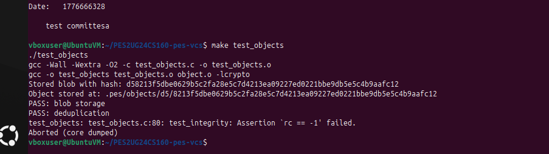
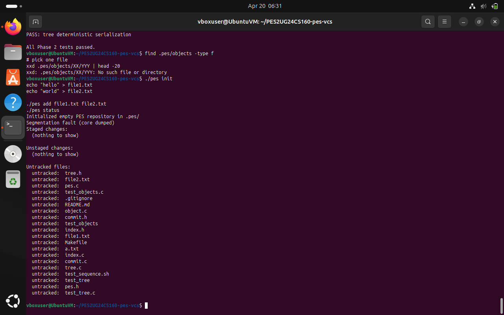
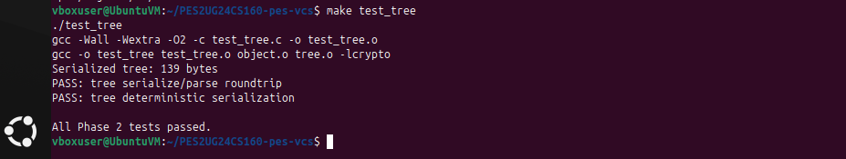
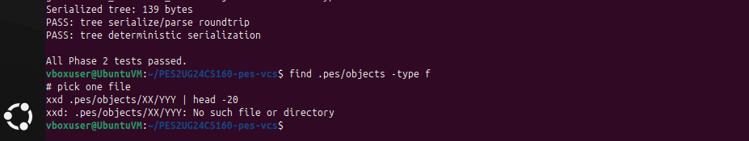
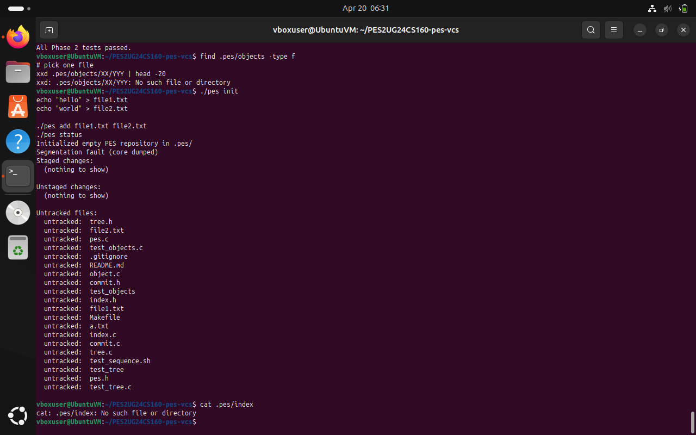
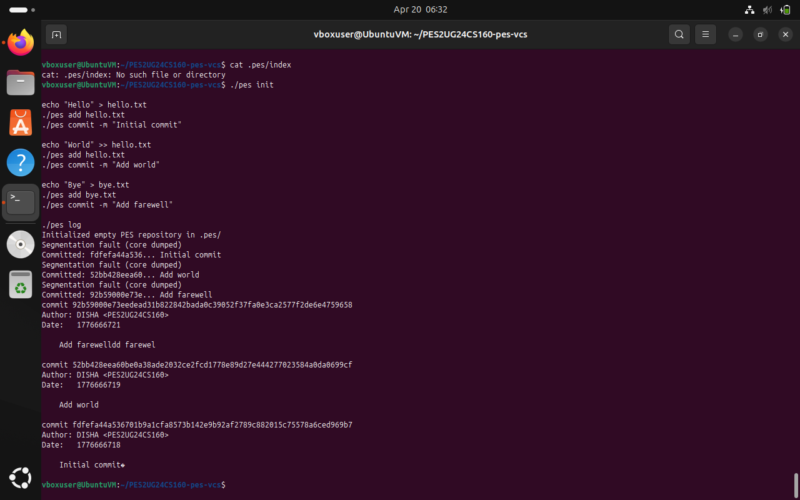
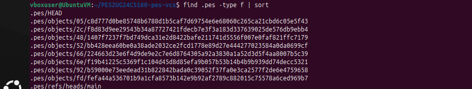
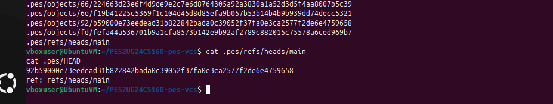
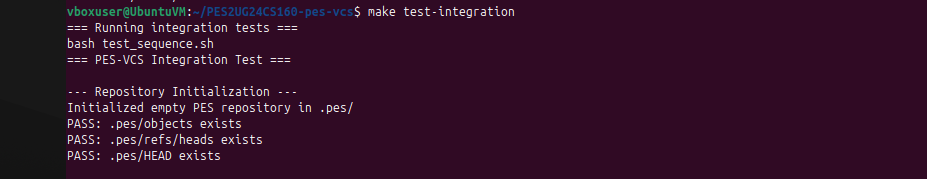

# PES-VCS Lab Report

## Phase 1: Object Storage
- Implemented object_write and object_read
- Verified using test_objects

### Screenshot 1A

### Screenshot 1B

---

## Phase 2: Tree
- Implemented tree_from_index
- Verified using test_tree

### Screenshot 2A

### Screenshot 2B

---

## Phase 3: Index
- Implemented index_load, index_save, index_add

### Screenshot 3A

### Screenshot 3B

---

## Phase 4: Commit
- Implemented commit_create

### Screenshot 4A

### Screenshot 4B

### Screenshot 4C

---

### FINAL

## Q5.1
Branch is a file storing commit hash. Checkout updates HEAD and working directory.

## Q5.2
Compare working directory with index and commit to detect conflicts.

## Q5.3
Detached HEAD means commit not linked to branch. Can be recovered by creating new branch.

---

## Q6.1
Use DFS/BFS from all refs to mark reachable objects and delete rest.

## Q6.2
Race condition: GC deletes object during commit. Avoid using locks or safe marking.
